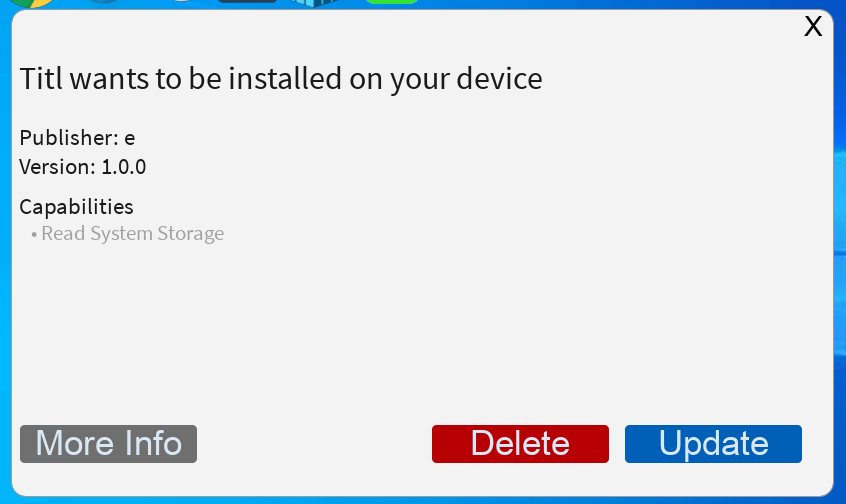

# AppInstaller Files

The `.appinstaller` file is used to prompt a user to download an application from the [App Store](https://application.novarietygames.xyz)

<figure><figcaption><p>The Install prompt for the app</p></figcaption></figure>

Here is some example `.appinstaller` xml.

```xml
<AppInstaller id="APPLICATION_ID" publisher="APPINSTALLER_PUBLISHER" version="APPINSTALLER_VERSION">
<Title>APP_TITLE</Title>
<Description>APP_DESCRIPTION</description>
<Capabilities> <FLAG>FLAGS</FLAG> </Capabilities>
</AppInstaller>
```

Capabilities Flags

```
READ_STORAGE: Read System Storage
SYSTEM_RESOURCES: Uses system resources
RAAD_REGISTRY: Read Registry entries
WRITE_REGISTRY: Write registry entries
DEFINE_POLICIES: (Not used)
```

The AppInstaller Attributes include id, publisher, and version. This is what appears on the application prompt. Not on the actual applicaton.

AppInstaller.id = Application ID off of [https://application.novarietygames.xyz](https://application.novarietygames.xyz) (This is the app ID that you want to install)\
AppInstaller.publisher = The application prompt publisher \
AppInstaller.version= The application prompt version\
AppInstaller.Capabilities= What is the application going to do? Does it access certain places. Let the user know what this application does

The more info button gives the application information from app store.

Once you have created your xml file, you can now use [commit.md](luascript/download/commit.md "mention") to prompt the user to download the application.

